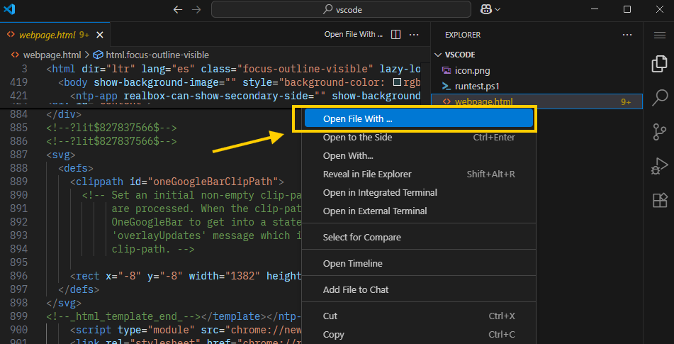
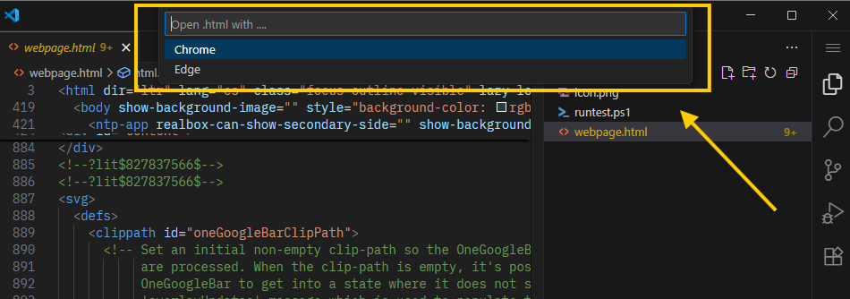
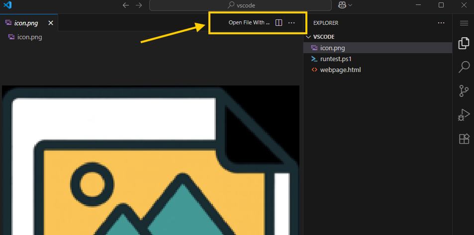
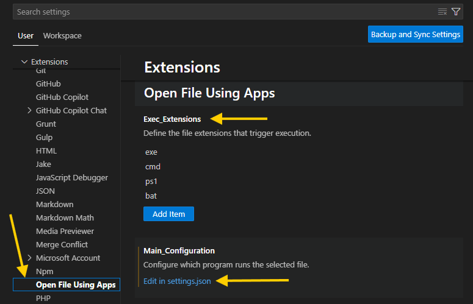

# ⚡ RUN WITH – VSCode Extension

<p align="center">
  
</p>

A simple and fast way to **run files with your favorite tools** directly from the VSCode context menu.  

---

## ✨ Features

- 📂 Right-click a file → **Open File With...**
- ⚙️ Choose the tool you want to run it with.
- 🔌 Works with scripts, executables, and more.

---

## 📦 Installation

1. Open **VSCode**
2. Go to **Extensions** (`Ctrl+Shift+X`)
3. Search for **RUN WITH** or search for **JuanJose** 
4. Click **Install**

---

## 🖱️ Usage

1. Right-click any file in Explorer  
    
2. Select **Open File With...**  
3. Choose your tool and run instantly ⚡
   
4. You can also select the option in the editor context:
   
---

## 🔧 Configuration

You can configure custom tools in your `settings.json`:
Go to settings and search for the extension name:

 

Option: `Exec_Extensions` Here you can add the extension name of a executable file. Eg: .exe, .sh ...

Option: `Main_Configuration`: Define the programs to run a specific file. Eg: select 'Edit in settings.json and add new app:

```jsonc
"run-with.Main_Configuration": {
    "png":[{"alias":"Paint","cmd":"mspaint.exe"}],
    "html": [
        {
            "alias": "Chrome",
            "cmd": "C:/Program Files/Google/Chrome/Application/chrome.exe"
        },
        {
            "alias": "Edge",
            "cmd": "C:/Program Files (x86)/Microsoft/Edge/Application/msedge.exe"
        }
    ],
    "ps1": [
        {
            "alias": "Run Pwsh",
            "cmd": "powershell.exe"
        }
    ]
}
```
