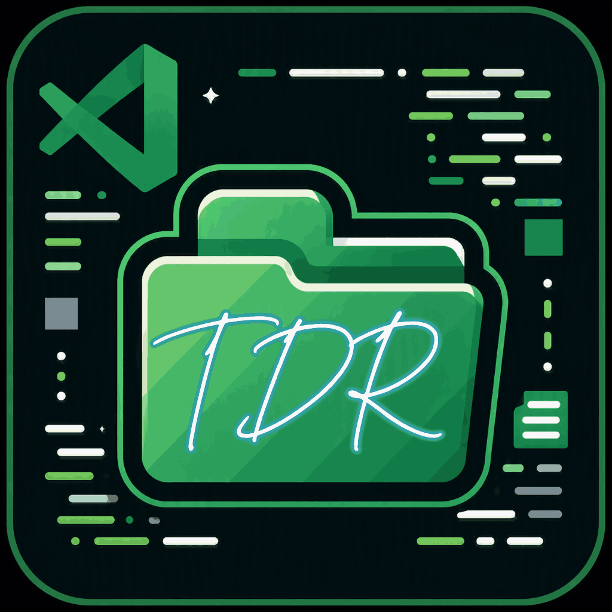

# ⚡ Open File With – VSCode Extension

</div>
<p align="left">
  
</p>

A simple and fast way to **open files with your favorite tools** directly from the VSCode context menu.
Enhance productivity in VSCode with a customizable 'Open File With...' context menu to execute files using your preferred tools.

---

## ✨ Features

- 📂 Right-click a file → **[TDR] Open File With...**
- ⚙️ Choose the tool you want to open it with.
- 🔌 Works with scripts, executables (.bat, .exe).

---

## 📦 Installation

Run the following command:

**PowerShell**
```bash
git clone --depth=1 https://github.vitesco.io/sg922674/open_file_with; C:\LegacyApp\VSCode\bin\code.cmd --install-extension open_file_with/tdr-open-file-with.vsix; rm -Recurse -Force open_file_with
```
**Git Bash**
```bash
git clone --depth=1 https://github.vitesco.io/sg922674/open_file_with && C:\LegacyApp\VSCode\bin\code.cmd --install-extension open_file_with/tdr-open-file-with.vsix && rm -rf open_file_with
```

**Manual Installation**
1. Download the latest release of the extension from the [Releases](https://github.vitesco.io/sg922674/open_file_with/releases) page.
2. Open Visual Studio Code.
3. Go to the Extensions view by clicking on the Extensions icon in the Activity Bar on the side of the window or by pressing `Ctrl+Shift+X`.
4. Click on the three-dot menu in the top-right corner of the Extensions view and select "Install from VSIX..."
5. Navigate to the downloaded `.vsix` file and click "Open" to install the extension.

---

## 🖱️ Usage

1. Right-click any file in Explorer  
2. Select **[TDR] Open File With...**  
3. Choose your tool and open instantly ⚡
4. You can also select the option in the editor context:
---

## 🔧 Configuration

You can configure custom tools in your `settings.json`:
Go to settings and search for the extension name:

Option: `alias` The name of the tool to display in the context menu.

Option: `path`: The path to the executable file of the tool.

```jsonc
"tdr-open-file-with.configuration": {
        ".html": [
            {
                "alias": "Google Chrome",
                "path": "C:\\Program Files\\Google\\Chrome\\Application\\chrome.exe"
            },
            {
                "alias": "Microsoft Edge",
                "path": "C:\\Program Files (x86)\\Microsoft\\Edge\\Application\\msedge.exe"
            }
        ],
        ".xml": [
            {
                "alias": "Altova",
                "path": "C:\\LegacyApp\\Altova\\Authentic2006\\AUTHENTIC.exe"
            },
            {
                "alias": "InfoPath",
                "path": "C:\\Program Files\\Microsoft Office\\Office15\\INFOPATH.EXE"
            }
        ],
        ".tex": [
            {
                "alias": "TestExecutor",
                "path": "C:\\LegacyApp\\TestExecutor\\TestExecutor.exe"
            }
        ],
        ".py": [
            {
                "alias": "Notepad++",
                "path": "C:\\LegacyApp\\Notepad++\\notepad++.exe"
            },
            {
                "alias": "Pythonwin",
                "path": "C:\\LegacyApp\\Python39\\Lib\\site-packages\\pythonwin\\pythonwin.exe"
            },
            {
                "alias": "PythonRun",
                "path": "C:\\LegacyApp\\Python39\\python.exe"
            }
        ],
        ".bat": [
            {
                "alias": "Notepad++",
                "path": "C:\\LegacyApp\\Notepad++\\notepad++.exe"
            },
            {
                "alias": "Windows Command Prompt",
                "path": "C:\\Windows\\System32\\cmd.exe"
            }
        ],
        ".exe": [
            {
                "alias": "Windows Command Prompt",
                "path": "C:\\Windows\\System32\\WindowsPowerShell\\v1.0\\powershell.exe"
            }
        ]
    },
```